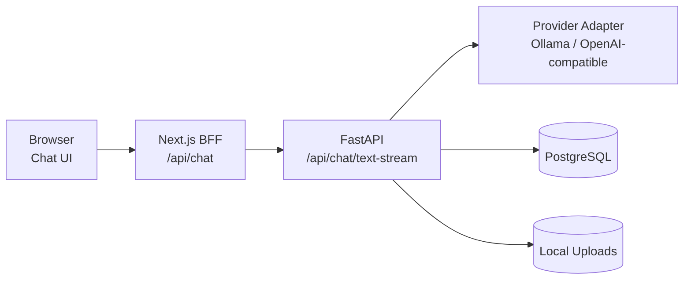

# AI Web Studio 项目总览（整理版）

> 更新时间：2026-05-10  
> 项目路径：`/disk2/gengnan/ai_web_studio`

## 一句话定位

这是一个前后端分离的本地多模态智能问答 Web 应用，当前已完成从账号体系、会话管理、流式聊天到附件上传与基础上下文治理的 MVP 闭环，可继续演进到更完整的上下文治理与检索增强能力。

## 当前状态摘要

- 已从教学 demo 迭代为可持续开发的产品化形态
- 主聊天链路已统一为 `前端 ReadableStream -> Next BFF -> FastAPI text-stream`
- 已具备用户隔离、会话持久化、消息持久化和基础设置管理
- 已接入图片与文档附件参与对话
- 已接入动态上下文预算与滚动摘要的第一阶段能力

## 技术栈

| 层 | 技术 |
|---|---|
| 前端 | Next.js 16、React 19、TypeScript、Tailwind CSS |
| 后端 | FastAPI、SQLAlchemy、Pydantic、Uvicorn |
| 数据库 | PostgreSQL（用户态部署） |
| 模型服务 | Ollama（默认模型：`qwen3.5:27b-q8_0`） |
| 运行环境 | Linux 普通用户环境（无 root 依赖） |

## 系统架构（当前实现）



## 代码目录速览

| 目录 | 作用 |
|---|---|
| `backend/app/api/routes` | 认证、会话、消息、设置、聊天、上传等接口 |
| `backend/app/services` | 聊天编排、Provider 访问、上下文治理、文件解析等业务逻辑 |
| `backend/app/repositories` | 数据访问层 |
| `backend/app/models` | 数据模型定义 |
| `backend/app/schemas` | 请求/响应 schema |
| `frontend/src/components` | 聊天主界面、线程、鉴权界面等 UI 组件 |
| `frontend/src/lib` | 前端类型、鉴权和后端调用封装 |
| `frontend/src/app/api` | BFF 代理与 session 接口 |
| `docs` | 产品方案、需求、技术设计、进展与上下文治理专题文档 |

## 已完成能力（按模块）

### 账户与会话

- 用户注册 / 登录
- JWT 鉴权
- 用户级会话隔离
- 会话列表、新建、重命名、删除

### 聊天与渲染

- 文本流式回复
- 停止生成
- Markdown 渲染
- 代码块复制
- 会话消息持久化

### 设置与模型接入

- Provider 切换
- 模型列表查询
- Provider 测试连接
- 用户设置持久化

### 附件与上下文

- 图片 / 文档上传入口
- 文档解析（`txt / md / pdf / docx`）
- 图片与文档内容注入当前轮上下文
- 上下文窗口与模式可配置
- 动态上下文预算框架接入
- 会话级滚动摘要字段接入

## 主要后端接口

- `GET /health`
- `POST /api/auth/register`
- `POST /api/auth/login`
- `GET /api/auth/me`
- `GET /api/models`
- `GET /api/settings`
- `PATCH /api/settings`
- `POST /api/settings/test-provider`
- `GET /api/conversations`
- `POST /api/conversations`
- `PATCH /api/conversations/{conversation_id}`
- `DELETE /api/conversations/{conversation_id}`
- `GET /api/conversations/{conversation_id}/messages`
- `POST /api/chat/text-stream`
- `POST /api/uploads`

## 本地启动方式（当前项目）

### 后端

```bash
cd /disk2/gengnan/ai_web_studio/backend
source /disk2/gengnan/miniconda3/etc/profile.d/conda.sh
conda activate ai_web_studio
PYTHONPATH=. uvicorn app.main:app --host 127.0.0.1 --port 32007
```

### 前端

```bash
cd /disk2/gengnan/ai_web_studio/frontend
npm install
npm run dev -- --hostname 127.0.0.1 --port 32008
```

## 项目文档地图（现有 docs）

| 文件 | 主题 | 当前用途 |
|---|---|---|
| `04_智能问答网页方案.md` | 产品定位与方向 | 定义第一版边界与对标方向 |
| `05_详细需求清单.md` | 功能清单与验收标准 | 约束范围、防止需求漂移 |
| `06_技术实现设计.md` | 技术架构与工程设计 | 落地选型与部署策略 |
| `07_当前实现进展与下一步计划.md` | 实现对齐与迭代节奏 | 盘点已完成能力与缺口 |
| `08_上下文治理研究与实施路线.md` | 行业研究与分阶段路线 | 指导中长期上下文优化 |
| `09_上下文配置与动态预算说明.md` | 参数解释与预算逻辑 | 解释设置项与后端换算机制 |

## 下一步建议（按优先级）

1. P0.5：补齐会话搜索、上下文统计可视化和摘要刷新策略可观测性
2. P1：完善附件索引化与按需展开，降低长对话噪音和延迟
3. P2：规划长期记忆层与检索增强（在现有上下文治理稳定后接入）

## 当前风险与注意点

- 上下文预算仍是近似换算，非 tokenizer 精确计量
- 文档与代码可能存在阶段性偏差，需要定期做“文档-实现对齐”
- 用户态 PostgreSQL 与本地模型资源占用需要持续监控

## 结论

项目已经跨过“能否跑通”的阶段，进入“产品化稳定迭代”阶段。  
短期应优先提高可观测性与长会话稳定性，再扩展高级能力（长期记忆 / RAG / Agent）。
